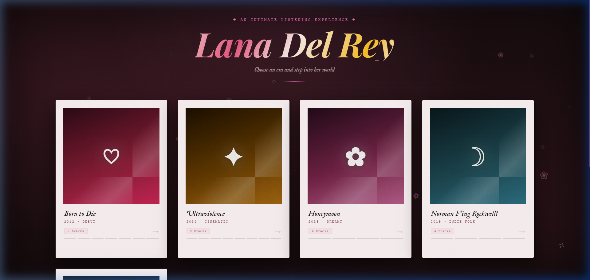
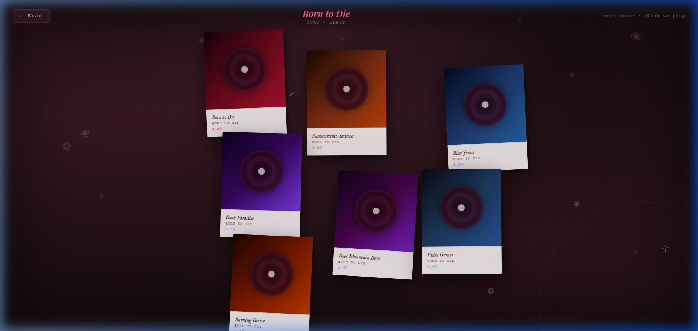
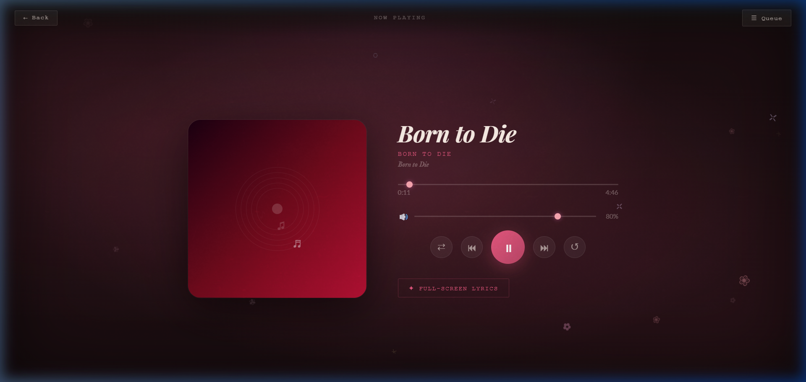
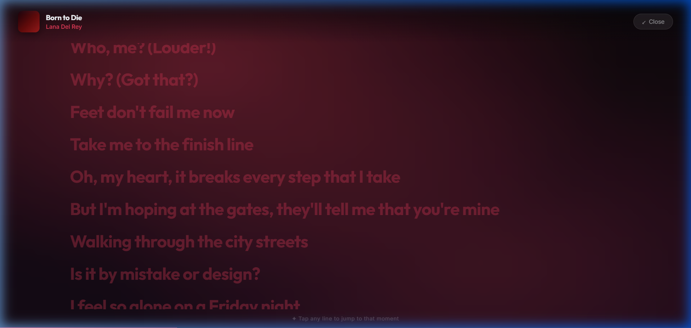

<div align="center">

# ♪🪄 Lana Del Rey — Kinetic Music Player

*An intimate, physics-driven listening experience built for fans, by a fan.*

<p>
  
  
  
  
</p>

</div>

---

## ✨ The Experience

> *"Choose an era and step into her world."*

This isn't a music player. It's a **shrine** — a beautifully crafted, interactive tribute to Lana Del Rey's discography, built with modern web technologies and a deep love for her aesthetic. Every screen feels like flipping through old film photographs.

---

## 📸 Screens

### 🌷 The Eras — Entry Page

> Five album eras presented as blush-toned polaroid cards, each tilted just slightly, the way a real photo would sit on a velvet table.



---

### 🎴 The Physics Wall

> Click an era and its songs burst into a physics-driven space — tumbling, drifting postcards that follow your mouse like they're drawn to you.




---

### 🎧 The Player

> Click any postcard and it *morphs* seamlessly into the full music player. Playfair Display italic titles, a spinning vinyl, floating music notes, and audio that actually plays from local files.



---

### 🎶 Full-Screen Lyrics

> Open the lyrics view to see every line synced exactly to the timestamp. Click any line to seek to that moment. The background shifts to the song's colour story.




---

## 5️⃣ The Five Eras

| Era | Symbol | Vibe | Tracks |
|:---|:---:|:---|:---:|
| **Born to Die** (2012) | ♡ | deep rose · debut · cinematic | 7 |
| **Ultraviolence** (2014) | ✦ | antique gold · moody · noir | 8 |
| **Honeymoon** (2015) | ✿ | dusty mauve · dreamlike · soft | 4 |
| **Norman F'ing Rockwell!** (2019) | ☽ | teal · indie folk · literary | 4 |
| **Blue Banisters** (2021) | ✧ | powder blue · baroque · intimate | 12 |

**35 songs. All local. All with time-synced lyrics.**

---

## 🛠️ Tech Stack

| Technology | Why it's here |
|:---|:---|
| **React 18** | Component architecture + `Context API` for global audio state |
| **Vite 7** | Blazing-fast dev server · `import.meta.glob` handles all filename edge cases |
| **Framer Motion** | `layoutId` shared morphing, stagger entrances, blur transitions |
| **Matter.js** | 2D physics for the song postcards — gravity, bounce, mouse attraction |
| **Vanilla CSS3** | Raw control over variables, `backdrop-filter`, `@keyframes`, gradients |
| **Web Audio API** | `HTMLAudioElement` with seek, volume, queue, and `onEnded` |
| **Custom LRC Parser** | Hand-rolled `parseLRC.js` — reads `.lrc` timestamp files for synced lyrics |
| **Playfair Display** | The editorial serif font that ties the whole aesthetic together |

---

## 🌸 The Aesthetic

Built around a **vintage film / romantic darkroom** mood:

- 🌸 **Cherry blossom petals** (✿ ❀ ✾) drift across every screen
- 💗 **Blush polaroid cards** — warm paper background, alternating tilts, spring-bounce hover
- 🎀 **Song postcards** with rosewood vinyl record art on the physics wall
- ✨ Animated `Lana Del Rey` title: **rose → gold → cream shimmer** on loop
- 🕯️ Film grain overlay on every page for that analogue, worn-in feel
- 💅 Square vintage buttons in **Courier New**, highlighted in soft pinks

---

## ⚙️ Run It Locally

```bash
git clone [https://github.com/yourusername/kinetic-music-player.git](https://github.com/Kavypatel07/kinetic-music-player.git)
cd kinetic-music-player

# Install dependencies
npm install

# Add your audio files to:
#   src/assets/audio/*.mp3
#   src/assets/lyrics/*.lrc

# Start the dev server
npm run dev
# → http://localhost:5173
```

> The app uses `import.meta.glob` under the hood, so any `.mp3` and `.lrc` files you drop into those folders are **automatically picked up** — no code changes needed.

---

## 🎓 About

Built as a personal portfolio piece at university — a deep-dive into advanced UI animation, physics in the browser, and the art of building interfaces that feel *alive*. Every design decision asked: *"What would Lana approve of?"*


---
## ⚠️ A Note on Copyright & Audio Files

This project is a deeply passionate, fan-made tribute to Lana Del Rey, designed strictly as a personal portfolio piece to showcase advanced front-end web development, physics-based UI (Matter.js), complex animations (Framer Motion), and custom audio engineering (Web Audio API).

To respect copyright laws and the intellectual property of Lana Del Rey and Universal Music Group, **all original `.mp3` audio files, copyrighted lyrics, and the populated SQLite database have been intentionally omitted from this public repository.** The code provided here contains the complete architectural shell and animation logic, but relies on placeholder data to prevent copyright infringement. 

### How to see the fully working project:
* **Visuals:** Please refer to the attached screenshots and GIFs below to see the cinematic "Eras" wall, the flowing UI transitions, and the vintage typewriter-style synced lyrics in action.
* **Full Live Demo:** If you would like to see a private, local demonstration of the fully functioning app with the audio engine processing the real tracks, please feel free to reach out to me directly! 

**Contact:**
You can reach me for a demo at:

🔗 [LinkedIn](#) &nbsp;·&nbsp; 🔗 [Portfolio](#) &nbsp;·&nbsp; 📧 [Email](#)

---
<div align="center">
  <i>Built with ♡ and a lot of Lana on repeat.</i>
</div>
